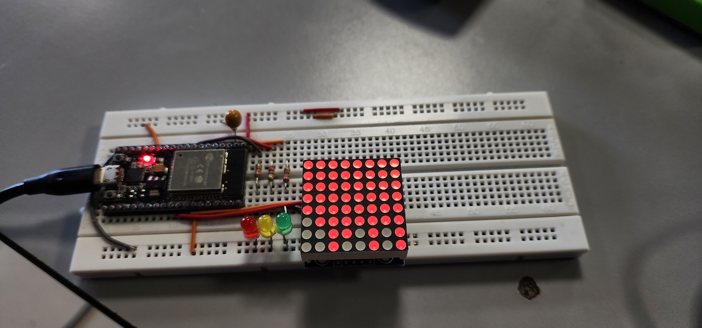

#       Proyecto 91-vending

 Austral 2023 - Informatica Electronica - Austral
 EAMartinez

El objetivo de este proyecto es mostrar como una plaqueta realizada con ESP32 permite simular, en parte, el funcionamiento de una maquina de venta.
La simulación de la bandeja de productos está realizada mediante un display de 8 x 8 LEDs matrizados, controlado por un circuito integrado MAX7219 al cual se accede por I2C; mediante ese dispositivo se simula una bandeja de 8 productos distintos que puede almacenar hasta 8 de cada uno de ellos.
Para otras partes de la simulación que pueda ser necesario, también se incluye el manejo de hasta 4 LEDS, siendo uno de ellos el que ya viene incluído en la placa de desarrollo de ESP32 y el manejo de un pulsador, que es el que esta en la placa de desarrollo como BOOT o IO0; de todas maneras, en este programa de demostración no se utilizan estos 4 LEDs ni el pulsador.

##      Hardware

 Placa de desarrollo de ESP32
 Pulsador Tact
 3 LEDs externos: 1 rojo, 1 amarillo, 1 verde
 3 Resistores de 220 ohm
 1 LED interno
 1 display de 8x8 LEDs con controlador MAX7219
 Cables Dupont

##      Conexiones

  Conectar el riel negativo del _protoboard_ (el azul)  al GND en placa de desarrollo de ESP32.

  Para cada LED externo:  
    * De GND al cátodo del LED
    * Del ánodo del LED al resistor de 220 ohm
    * Del otro extremo del resistor de 220 ohm al GPIO respectivo  

  Conectar a los siguientes GPIOs:  
    * LED rojo a 'LED_RED'  
    * LED amarillo a 'LED_YEL'  
    * LED verde a 'LED_GRN'  

  Conectar a la placa de 8x8 LED los siguientes contactos:
    * VCC a +5V a traves de la salida VIN de la placa de desarrollo de ESP32
    * GND al riel negativo
    * DIN a la salida MOSI ubucada en GPIO 23
    * CS a GPIO denominado 'CS_PIN' en platformio.ini

##      platformio.ini

#####   Definiciones de salidas

  * 1 por cada LED externo  
  * 1 para el LED interno
  * 1 para el CS del MAX7219 de la placa de 8x8 LEDs 'CS_PIN'

#####   Definiciones de entrada

  * 1 para el pulsador

#####   Velocidad de comunicación

  'BAUD' utilizada para inicalizar el dispositivo 'Serial'

##### Bibliotecas

  * 'MD_MAX72XX' para el manejo de la placa de 8x8 LEDs
  * 'SPI' ya que el MAX7219 se comunica por Serial Peripheral Interface

##### Testing

  Siempre que se coloca hardware manejado por el procesador, es aconsejable dejar rutinas de prueba en el codigo para verificar que el hardware agregado funciona adecuadamente.

  Es por ello, que se definen los siguientes símbolos en platformio.ini

  * 'LED_TEST' para prueba de los LEDs
  * 'MATRIX_TEST' para prueba de la matriz de LEDs

  Se observa que no hay prueba de funcionamiento del pulsador, pues es hardware que no fue agregado, sino que forma parte de la placa de desarrollo.

  El hecho de activar con un '1' a cada uno de estos símbolos, dará lugar a que se realice la rutina de testing y no el programa objeto del proyecto.
  Tal cual se obtiene el programa despues de una _clonación_ de github, ambos testing están deshabilitados

##      Funcionamiento del programa

  Cuando arranca el programa, observará que la matriz de 8x8 esta totalmente iluminada; ello significa que la bandeja de la máquina simulada de venta está completa con los 8 elementos de cada uno de los 8 productos.

  El programa acepta entrada del teclado de la computadora, por lo cual es necesario correr el programa y después acivar el monitor serie; sería conveniente que después de activar el monitor, proceda a hacer un reset de la placa de desarrollo para poder ver los textos de interacción con el usuario

  Se pueden ingresar números de producto de '1' a '8', con lo cual observar'a el proceso simulado de venta en la matriz 8x8

  Si quiere recargar el stock completo, basta con ingresar el número 99

##      Fotos

  En la sigiuente foto, puede verse como queda el display 8x8 despues de hacer las siguentes ventas:

  * 3 ventas del producto 1
  * 2 ventas del producto 2
  * 1 venta del producto 4
  * 2 ventas del producto 5
  * 2 ventas del producto 7

 

##      Datos de la matriz de 8x8 LEDs con MAX7219

  Solo a titulo de ejemplo, se da el vínculo a un producto ofrecido en MercadoLibre
  Verificar que lo que compren incluya tanto la matriz de display de 8x8 como tambien la placa con el integrado de manejo MAX7291

  [Módulo Display Matriz 8x8 Led Max7219 (ML)](https://articulo.mercadolibre.com.ar/MLA-880066062-modulo-display-matriz-8x8-led-max7219-arm-robotica-arduino-_JM)

